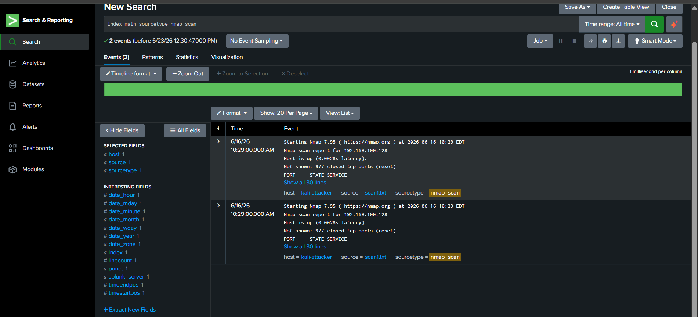
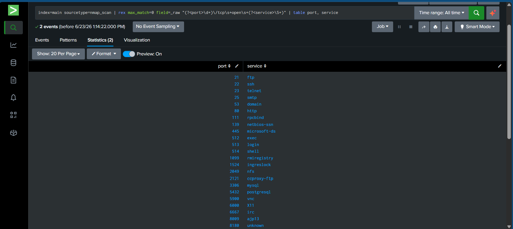
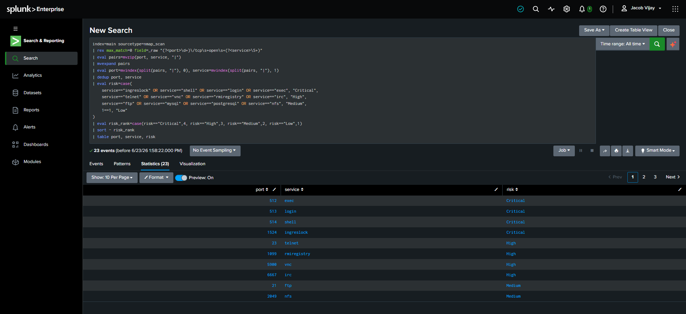
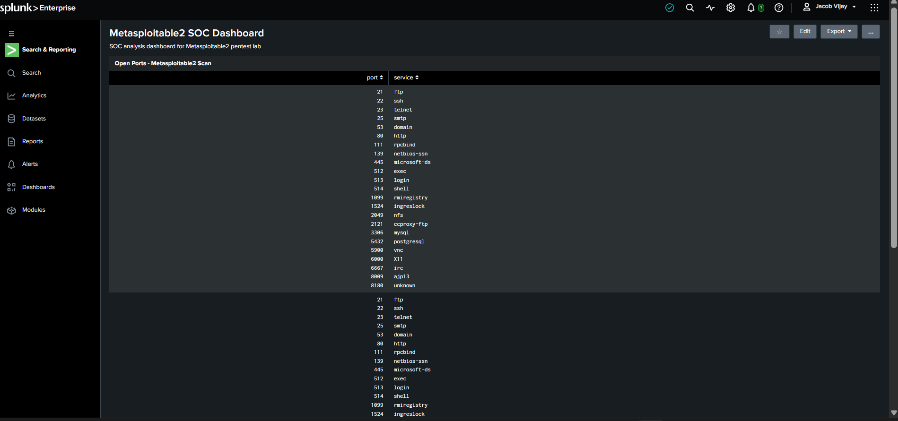
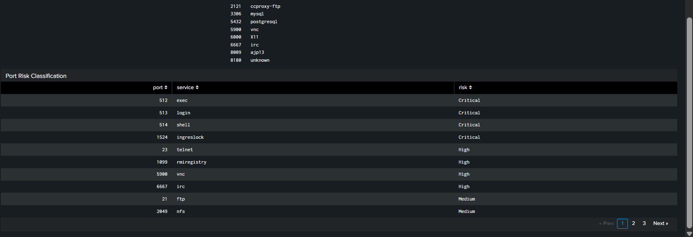
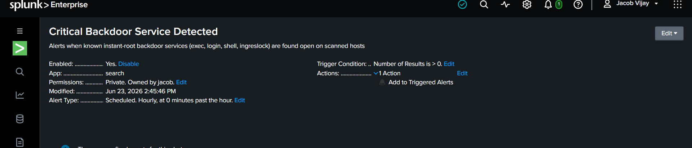
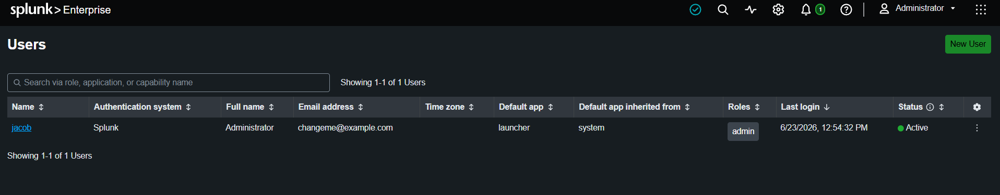

# Splunk SOC Lab — Nmap Threat Detection & Risk Triage

**Author:** Vijay S
**Role Target:** SOC Analyst / Entry-Level Penetration Tester
**Environment:** Splunk Enterprise 10.4.0 (Windows host) · Kali Linux · Metasploitable2 · Isolated VMnet1 host-only network
**Project Repo:** [github.com/JacobVijay26/Vijay_cybersecurity](https://github.com/JacobVijay26/Vijay_cybersecurity)

---

## Overview

This project bridges offensive lab work with defensive SOC tooling. Output from a real penetration-testing engagement against Metasploitable2 (an Nmap scan capturing 23 open ports) was ingested into Splunk Enterprise and transformed into a working SOC monitoring solution: a custom field-extracted data pipeline, a two-panel triage dashboard, and a scheduled detection alert for critical backdoor services.

The goal was not just to display data, but to demonstrate the analyst workflow a SOC role requires — ingest, parse, classify by risk, visualize, and alert.

---

## Architecture

```
┌─────────────────┐      attacks      ┌────────────────────┐
│   Kali Linux    │ ────────────────▶ │   Metasploitable2   │
│   (Attacker)    │   Nmap scan        │     (Target)        │
└─────────────────┘                    └────────────────────┘
         │
         │  scan output (scan1.txt) ingested into
         ▼
┌──────────────────────────────────────────┐
│           Windows Host                     │
│       Splunk Enterprise 10.4.0             │
│  ┌──────────────────────────────────────┐  │
│  │ • Custom sourcetype: nmap_scan        │  │
│  │ • SPL field extraction (rex/mvexpand) │  │
│  │ • Risk classification (eval case)     │  │
│  │ • 2-panel SOC dashboard               │  │
│  │ • Scheduled detection alert           │  │
│  └──────────────────────────────────────┘  │
└──────────────────────────────────────────┘
```

---

## Skills Demonstrated

| Skill | Implementation |
|-------|----------------|
| Data ingestion | Uploaded Nmap scan to Splunk with custom sourcetype `nmap_scan`, host `kali-attacker` |
| Search Processing Language (SPL) | Field-based filtering, Boolean search, `stats`, keyword highlighting |
| Custom field extraction | `rex` with `max_match=0` to extract all port/service pairs from raw event text |
| Multivalue field handling | `mvzip` + `mvexpand` + `mvindex(split())` to split combined fields into discrete rows |
| Data deduplication | `dedup` to collapse duplicate ingested events into unique findings |
| Risk classification logic | `eval case()` to tag each service Critical / High / Medium / Low |
| Result ranking | Secondary `eval` rank field + `sort` for proper severity ordering |
| Dashboard creation | Classic Dashboard with two statistics-table panels |
| Detection alerting | Scheduled alert with trigger condition and triggered-alert action |
| RBAC / capability management | Granted `delete_by_keyword` capability to admin role (least-privilege concept) |
| Time-range scoping | Hardcoded `earliest=0` into search to make scheduled alert reliable |

---

## Implementation Walkthrough

### 1. Data Ingestion
The Nmap scan (`scan1.txt`) was uploaded via **Settings → Add Data → Upload** with:
- **Sourcetype:** `nmap_scan` (custom, reusable)
- **Host:** `kali-attacker` (represents scan origin — meaningful for later correlation)
- **Index:** default (`main`)



### 2. Baseline SPL Searches
```spl
index=main host="kali-attacker"
index=main sourcetype=nmap_scan "open"
index=main sourcetype=nmap_scan ("1524" OR "445" OR "21")
index=main sourcetype=nmap_scan | stats count
```
These confirmed ingestion and demonstrated how a SOC analyst threat-hunts for known-malicious ports.

### 3. Field Extraction (All Ports)
Splunk's default extraction only captures the first regex match per event. Using `max_match=0` captures every match:
```spl
index=main sourcetype=nmap_scan
| rex max_match=0 field=_raw "(?<port>\d+)\/tcp\s+open\s+(?<service>\S+)"
| table port, service
```
**Result:** all 23 open ports correctly extracted (ftp, ssh, telnet, smtp, samba, mysql, postgresql, vnc, irc, ingreslock, etc.).



### 4. Multivalue Expansion + Risk Classification
The extracted `port` and `service` fields were multivalue (lists within a single event), which broke per-row logic. They were split into true discrete rows, deduplicated, then risk-classified:
```spl
index=main sourcetype=nmap_scan earliest=0
| rex max_match=0 field=_raw "(?<port>\d+)\/tcp\s+open\s+(?<service>\S+)"
| eval pairs=mvzip(port, service, "|")
| mvexpand pairs
| eval port=mvindex(split(pairs, "|"), 0), service=mvindex(split(pairs, "|"), 1)
| dedup port, service
| eval risk=case(
    service=="ingreslock" OR service=="shell" OR service=="login" OR service=="exec", "Critical",
    service=="telnet" OR service=="vnc" OR service=="rmiregistry" OR service=="irc", "High",
    service=="ftp" OR service=="mysql" OR service=="postgresql" OR service=="nfs", "Medium",
    1==1, "Low")
| eval risk_rank=case(risk=="Critical",4, risk=="High",3, risk=="Medium",2, risk=="Low",1)
| sort - risk_rank
| table port, service, risk
```



### Risk Classification Rationale

| Risk | Services | Why |
|------|----------|-----|
| **Critical** | ingreslock, shell, login, exec | Instant-root backdoors / unauthenticated remote command execution (exploited directly in the pentest) |
| **High** | telnet, vnc, rmiregistry, irc | Legacy/weak protocols, cleartext credentials, known RCE vectors |
| **Medium** | ftp, mysql, postgresql, nfs | Commonly misconfigured services exposing data or weak auth |
| **Low** | all others | Standard services requiring deeper review |

### 5. SOC Dashboard
A Classic Dashboard (`Metasploitable2 SOC Dashboard`) was built with two panels:
1. **Open Ports — Metasploitable2 Scan** — raw port/service inventory
2. **Port Risk Classification** — severity-tagged triage view, sorted Critical → Low




### 6. Detection Alert
A scheduled alert (`Critical Backdoor Service Detected`) was created:
```spl
index=main sourcetype=nmap_scan earliest=0
| rex max_match=0 field=_raw "(?<port>\d+)\/tcp\s+open\s+(?<service>\S+)"
| eval pairs=mvzip(port, service, "|")
| mvexpand pairs
| eval port=mvindex(split(pairs, "|"), 0), service=mvindex(split(pairs, "|"), 1)
| dedup port, service
| where service IN ("ingreslock","shell","login","exec")
```
- **Schedule:** Hourly
- **Trigger:** Number of results > 0
- **Action:** Add to Triggered Alerts



---

## Lessons Learned

- **Splunk is append-only.** Re-uploading a file does not overwrite — it duplicates. Duplicate events must be removed with `| delete` (or handled with `dedup`).
- **`delete` is privilege-gated.** Even the Administrator account lacks the `delete_by_keyword` capability by default — a deliberate least-privilege safety control. It must be explicitly granted at the role level.
- **Inline UI field extractions only capture the first match.** Multivalue extraction requires `max_match=0` in-search, or `MV_ADD=true` in `transforms.conf`. In practice, analysts often use `rex max_match=0` directly in searches.
- **The time-range picker does not persist for scheduled alerts.** Splunk warns that picker changes won't be saved; reliable scheduling requires baking the range into the search text (`earliest=0`).
- **Manually running an alert search does not fire its actions.** Only the scheduler firing on the configured cron triggers the alert action.



---

## Files in This Folder

| File | Description |
|------|-------------|
| `README.md` | This document |
| `Splunk_SOC_Lab_Report_Vijay_S.docx` | Full professional project report (includes embedded screenshots) |
| `screenshots/00-data-ingestion.png` | Raw Nmap events as ingested into Splunk |
| `screenshots/01-field-extraction.png` | All 23 ports/services extracted via `rex max_match=0` |
| `screenshots/02-risk-classification.png` | Full SPL query + risk-tagged results table |
| `screenshots/03-dashboard-open-ports.png` | Dashboard panel — raw port/service inventory |
| `screenshots/04-dashboard-risk-panel.png` | Dashboard panel — severity-sorted triage view |
| `screenshots/05-alert-config.png` | Saved alert configuration (schedule, trigger, action) |
| `screenshots/06-rbac-users.png` | User-role assignment supporting the RBAC lesson learned |

---

## Next Steps

- Ingest additional data sources (Metasploit exploit logs, DVWA access logs, Wireshark exports) for multi-source correlation
- Add visualization panels (severity distribution bar/pie chart)
- Build correlation searches across attack stages
- Progress toward Splunk Core Certified User / Power User certification
