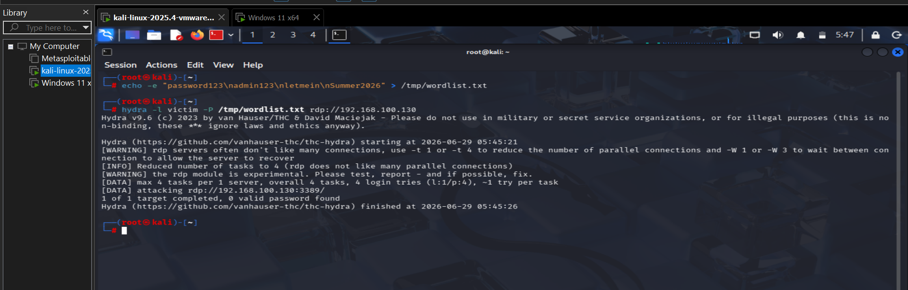
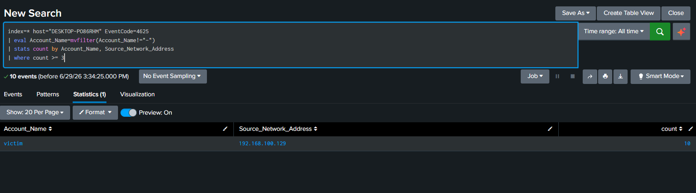
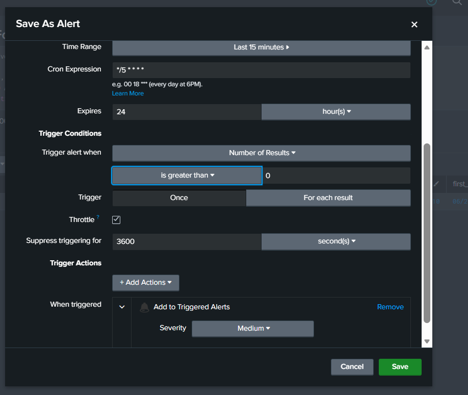
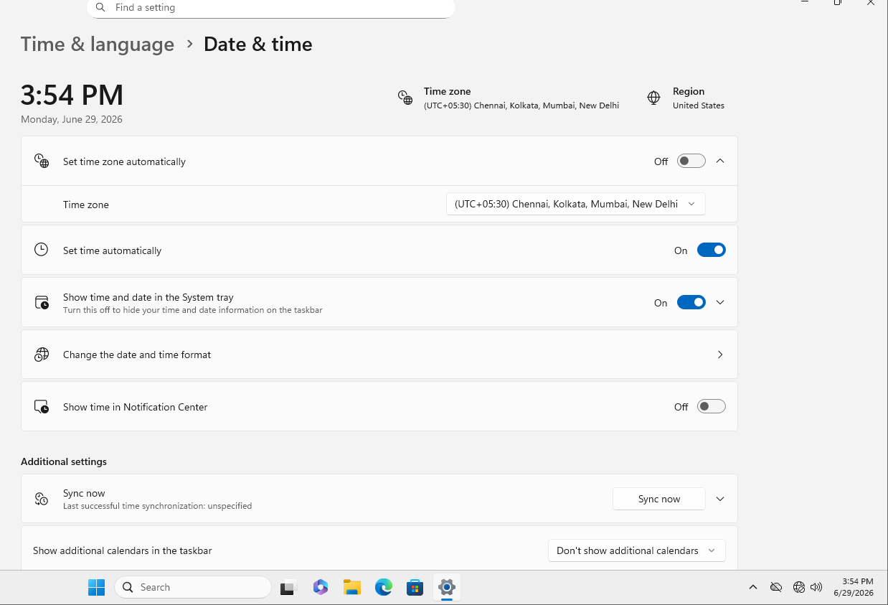
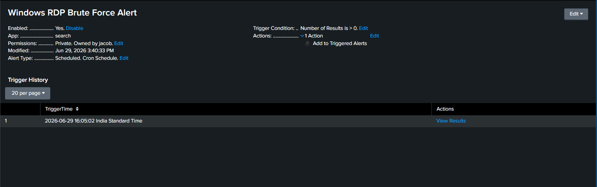
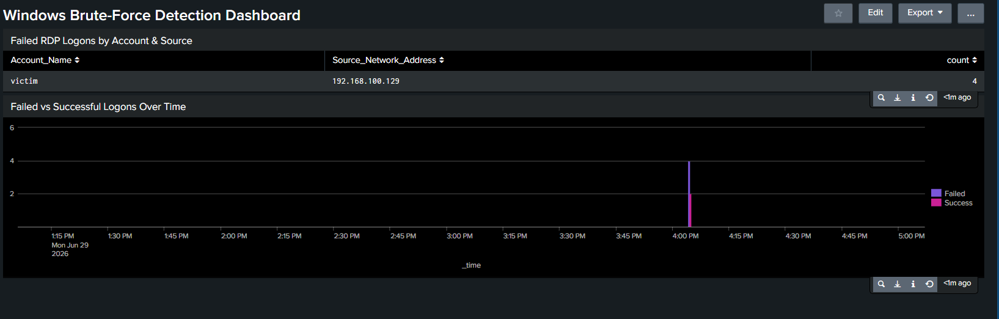

# Windows RDP Brute-Force Detection Lab

**Author:** Vijay S
**Role Target:** SOC Analyst / Entry-Level Penetration Tester
**Environment:** Splunk Enterprise 10.4.0 · Splunk Universal Forwarder · Kali Linux · Windows 11 Enterprise · Isolated VMnet1 host-only network
**Project Repo:** [github.com/JacobVijay26/Vijay_cybersecurity](https://github.com/JacobVijay26/Vijay_cybersecurity)

A Splunk SIEM detection engineering project simulating and detecting an RDP brute-force attack against a Windows 11 host, using native Windows Security Event Logs forwarded through a production-style Splunk Universal Forwarder pipeline.

This lab complements an earlier all-Linux SOC lab by adding Windows Event Log coverage (Event IDs 4624/4625), and demonstrates the full detection engineering lifecycle: infrastructure build → attack execution → detection logic → alerting → dashboarding → documentation.

📄 **Full report:** [Windows_RDP_Brute_Force_Lab_Report_Vijay_S.docx](./Windows_RDP_Brute_Force_Lab_Report_Vijay_S.docx) · [PDF version](./Windows_RDP_Brute_Force_Lab_Report_Vijay_S.pdf)

---

## MITRE ATT&CK Mapping

| Technique | ID |
|---|---|
| Brute Force | [T1110](https://attack.mitre.org/techniques/T1110/) |

---

## Lab Architecture

| Component | Details |
|---|---|
| Attacker | Kali Linux — `192.168.100.129` |
| Target | Windows 11 Enterprise — `192.168.100.130` (hostname `DESKTOP-PO86RHM`) |
| Test Account | `victim` (added to Remote Desktop Users) |
| SIEM Host | Splunk Enterprise 10.4.0 — `192.168.100.1`, receiving on port `9997` |
| Log Forwarding | Splunk Universal Forwarder 10.4.0 (Windows Security + System logs) |
| Network | VMware VMnet1 (host-only, isolated, no internet access) |
| Attack Tool | Hydra v9.6 (RDP module) |

All systems run as VMware Workstation VMs on a single isolated host-only network, ensuring attack traffic and log data never leave the lab environment.

---

## Build Process

Setting up the Windows target surfaced several realistic infrastructure issues, each independently diagnosed and resolved:

- **Vulkan renderer crash** on VM power-on — fixed by disabling 3D acceleration (known VMware Workstation defect)
- **Offline Windows activation** — temporarily switched to NAT to reach Microsoft's activation servers, activated via `slmgr /ato`, reverted to the isolated network
- **RDP enablement** — enabled Remote Desktop, created the `victim` test account, verified port 3389 reachability via Nmap from Kali *before* running any attack tooling
- **Universal Forwarder `outputs.conf`** — File Explorer's editor and the Windows 11 Notepad app both failed to open/save the config; resolved by writing it directly via elevated PowerShell (`Set-Content`)
- **Missing host VMnet1 adapter** — the host had no IP on the lab network at all; fixed via VMware's Virtual Network Editor
- **Blocked forwarder traffic** — `Test-NetConnection` isolated the cause to a missing Windows Defender Firewall inbound rule for port 9997 on the host; added the rule and re-verified

Full detail and exact commands are in the [Word report](./Windows_RDP_Brute_Force_Lab_Report_Vijay_S.docx).

---

## Attack Execution

```
hydra -l victim -P /tmp/wordlist.txt rdp://192.168.100.130
```

Hydra's RDP module is experimental and frequently reports "0 valid password found" even when the correct password was supplied — confirmed directly in this lab, since Windows independently logs every authentication attempt regardless of what Hydra's own success-detection logic concludes.



---

## Detection Engineering

Each failed RDP logon generates a Windows Security **Event ID 4625**. The `Account_Name` field on these events is multivalued — it contains both a blank Subject account (`-`) and the real Target account in the same field — which silently breaks naive filtering.

**Final detection search:**

```spl
index=* host="DESKTOP-PO86RHM" EventCode=4625
| eval Account_Name=mvfilter(Account_Name!="-")
| stats count by Account_Name, Source_Network_Address
| where count >= 3
```

Two lessons learned along the way:
1. Filtering with a bare `Account_Name!="-"` directly on the raw search excludes **every** 4625 event, since the field always contains `-` as one of its two values. `mvfilter()` must be used to collapse the field first.
2. The native Windows field for the source IP is `Source_Network_Address` — not the Splunk CIM field `src_ip`.



---

## Alert Configuration

| Setting | Value |
|---|---|
| Time Range | Last 15 minutes |
| Cron Schedule | `*/5 * * * *` (every 5 minutes) |
| Trigger Condition | Number of Results > 0 |
| Trigger Mode | For each result |
| Throttle | Enabled — suppress for 3,600 seconds (1 hour) |
| Severity | Medium |

Throttling prevents an ongoing attack from generating a duplicate alert every 5 minutes for the same attacker, while still re-surfacing genuinely new activity after an hour.



---

## Troubleshooting: Clock Synchronization

After saving the alert, it failed to fire — manual searches scoped to "Last 15 minutes" returned zero results even immediately after a confirmed attack, while the same search scoped to "All time" found the data correctly. That pattern pointed to a clock/timezone issue rather than a search logic error.

**Root cause:** the Windows VM's timezone was set to a US zone while the Splunk host runs on India Standard Time — and Windows' internet-based time sync was silently failing because the VM sits on an isolated, internet-less network.

**Fix:**
1. Set the VM's timezone to `(UTC+05:30) Chennai, Kolkata, Mumbai, New Delhi`
2. Enabled **"Synchronize guest time with host"** in VMware Tools (works without internet)
3. Restarted the Splunk Universal Forwarder service



---

## Verification

With the clock corrected, a fresh attack was run and the alert fired automatically on its next scheduled cron tick — no manual search required.



---

## Dashboard

A two-panel dashboard summarizes the detection: a results table (account, source, attempt count) and a timeline chart visualizing failed attempts immediately followed by a successful logon.



---

## Skills Demonstrated

- Windows Security Event Log analysis (4624/4625) and authentication forensics
- Splunk Universal Forwarder deployment and Windows-to-Splunk log forwarding
- SPL detection engineering — multivalue field handling, CIM vs. native field reconciliation
- Splunk alert engineering — scheduling, trigger conditions, throttle/suppression design
- Splunk dashboard design for analyst-facing detection summaries
- Adversary simulation with Hydra against RDP, including working around tool-reporting quirks
- Systematic infrastructure troubleshooting — VM hypervisor issues, virtual networking, OS firewall diagnostics, cross-timezone clock synchronization

---

## Repository Contents

| File | Description |
|---|---|
| `README.md` | This document |
| `Windows_RDP_Brute_Force_Lab_Report_Vijay_S.docx` | Full professional project report (includes embedded screenshots) |
| `Windows_RDP_Brute_Force_Lab_Report_Vijay_S.pdf` | PDF version of the same report |
| `screenshots/01_hydra_attack_initial.png` | Hydra RDP brute-force attempt |
| `screenshots/03_detection_search_result.png` | SPL detection search result |
| `screenshots/04_save_as_alert_config.png` | Saved alert configuration |
| `screenshots/07_clock_after_fix.png` | Clock synchronization before/after fix |
| `screenshots/11_alert_trigger_history.png` | Alert firing automatically on schedule |
| `screenshots/13_final_dashboard.png` | Final two-panel analyst dashboard |

---

## Related Projects

- [Splunk SOC Lab](../04-Splunk-SOC-Lab/) — the earlier Linux-focused detection lab this project complements

Part of a broader cybersecurity portfolio spanning blue team detection engineering and red team offensive security. See the [profile README](https://github.com/JacobVijay26/Vijay_cybersecurity) for the full project index.
