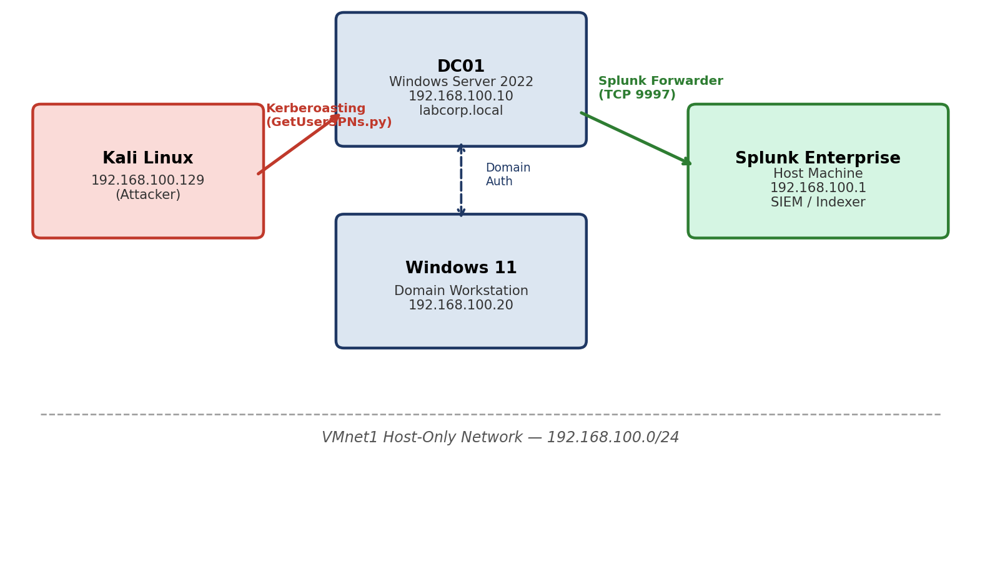

[README.md](https://github.com/user-attachments/files/29914539/README.md)
# Active Directory Kerberoasting Detection Lab

A self-hosted Active Directory lab simulating a Kerberoasting attack (MITRE ATT&CK **T1558.003**) and building a working Splunk detection, dashboard, and scheduled alert for it.

## Overview

This project walks through the full lifecycle of a Kerberoasting attack:

1. Build a realistic, isolated Active Directory environment
2. Deliberately create a Kerberoastable service account (a common real-world misconfiguration)
3. Execute the attack from Kali Linux using Impacket
4. Detect the attack in Splunk using Windows Security Event ID 4769
5. Build a dashboard and a scheduled alert around the detection

Full write-up, screenshots, and analysis are in [`AD_Kerberoasting_Detection_Lab_Report.docx`](./AD_Kerberoasting_Detection_Lab_Report.docx).

## Architecture

| Host | Role | IP Address |
|---|---|---|
| DC01 | Domain Controller / DNS (Windows Server 2022) | 192.168.100.10 |
| Windows 11 | Domain-joined workstation | 192.168.100.20 |
| Kali Linux | Attacker machine | 192.168.100.129 (DHCP) |
| Splunk Enterprise | SIEM / Indexer (host machine) | 192.168.100.1 |

All VMs run on an isolated VMware Workstation host-only network (VMnet1, `192.168.100.0/24`).



## Tools Used

- **VMware Workstation** — isolated lab virtualization
- **Windows Server 2022** — Active Directory Domain Services, DNS
- **Sysmon** (SwiftOnSecurity config) — enhanced endpoint telemetry
- **Splunk Enterprise 10.4.0** + **Splunk Universal Forwarder** — SIEM / detection
- **Kali Linux** + **Impacket** (`GetUserSPNs.py`) — attack execution

## Attack Summary

A low-privilege domain user (`janalyst`) — simulating a compromised standard account with no elevated rights — was used to request a Kerberos service ticket (TGS) for a deliberately misconfigured service account (`svc_sql`) with a registered SPN:

```
impacket-GetUserSPNs labcorp.local/janalyst:'********' -dc-ip 192.168.100.10 -request
```

The attack successfully extracted an RC4-encrypted TGS ticket (`$krb5tgs$23$...`), ready for offline password cracking — without any further contact with the domain controller.

## Detection

The attack generates Windows **Security Event ID 4769** with `Ticket_Encryption_Type=0x17` (RC4) — a strong signal since modern legitimate Kerberos traffic predominantly uses AES.

**Core detection query:**

```spl
index=main sourcetype=WinEventLog:Security EventCode=4769 Ticket_Encryption_Type=0x17
| table _time, Account_Name, Service_Name, Client_Address, Ticket_Encryption_Type
```

**Higher-fidelity, threshold-based variant** (reduces false positives from legacy RC4-only systems):

```spl
index=main sourcetype=WinEventLog:Security EventCode=4769 Ticket_Encryption_Type=0x17
| stats count dc(Service_Name) as unique_spns_requested values(Service_Name) as targets by Account_Name, Client_Address
| where unique_spns_requested >= 3
```

## Dashboard & Alert

- **Dashboard:** *Kerberoasting Detection Dashboard* — live table of RC4 TGS requests
- **Scheduled Alert:** *Kerberoasting Detection - RC4 TGS Request* — runs every 5 minutes (`*/5 * * * *`), triggers when results > 0

## Mitigation Recommendations

- Enforce AES-only Kerberos encryption via Group Policy (`msDS-SupportedEncryptionTypes`)
- Migrate service accounts to Group Managed Service Accounts (gMSAs)
- Monitor Event ID 4769 with RC4 encryption type as a standing detection rule
- Regularly audit Active Directory for accounts with unnecessary SPNs

## Full Report

See [`AD_Kerberoasting_Detection_Lab_Report.docx`](./AD_Kerberoasting_Detection_Lab_Report.docx) for the complete write-up, including build steps, troubleshooting notes (Sysmon channel permissions on a Domain Controller, VM clock drift and its effect on Kerberos), false-positive analysis, and lab cleanup/teardown steps.

---
*Part of a hands-on cybersecurity portfolio — see the [root README](../../README.md) for other projects.*
